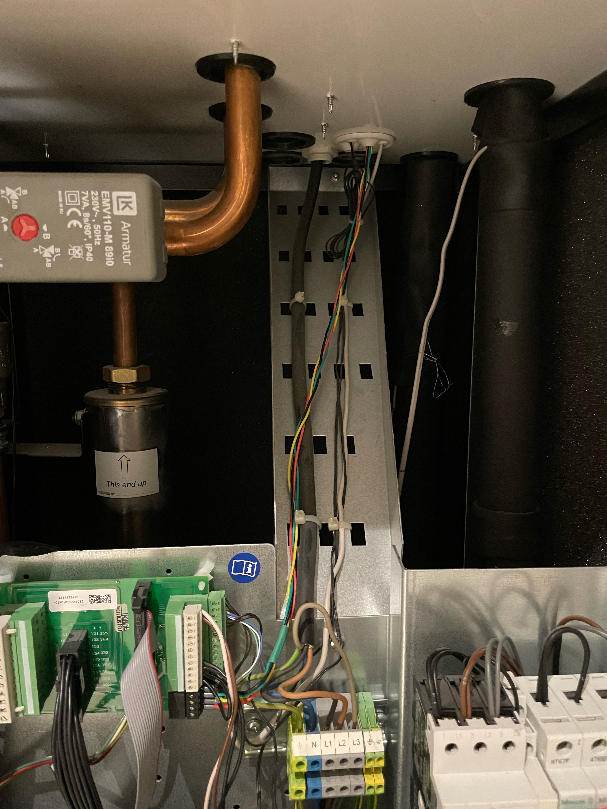

ESPHome component for Rego 1000 heat pump controller, found in:

* IVT Greenline HE/HC/HA
* IVT Premiumline A Plus
* IVT Premiumline EQ
* IVT Premiumline HQ

### Features

* Poll any variable from heat pump (temperature sensors, timers, PID control values..)
* Read any passive data on the heat pump CAN bus (used for i.e. compressor on/off state)
* Set indoor setpoint using the Home assistant climate integration
* Act as an IVT indoor sensor using the temperature from a home assistant integrated temperature sensor
* Set any heat pump variable, e.g. hysterisis, admin access, hot water eco/comfort mode

### Installation

If the calculated sensor `Energy consumption compressor` will be used the estimated compressor power consumption should be set (or added if missing) in the `rego1000-vx.x.x.yaml file`

Make changes to secrets and CAN bus pins in rego1000.yaml, then install it on the ESP32 using

```bash
esphome run rego1000-<version>.yaml
```

### Connection




<table>
  <tr>
    <th>Colour</th>
    <th>Function</th>
    <th>Pint No.</th>
  </tr>
  <tr>
    <td>Black</td>
    <td>Ground</td>
    <td>35</td>
  </tr>
  <tr>
    <td>Green</td>
    <td>can L</td>
    <td>36</td>
  </tr>
  <tr>
    <td>Yellow</td>
    <td>can H</td>
    <td>37</td>
  </tr>
  <tr>
    <td>Red</td>
    <td>+12v</td>
    <td>38</td>
  </tr>
</table>
